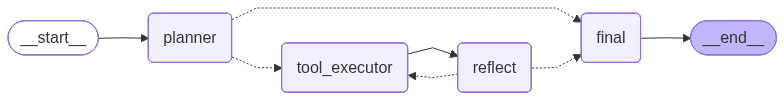
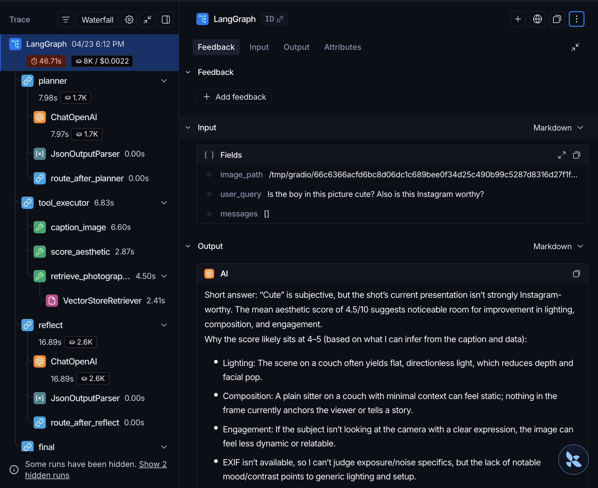

# 📸 PhotoCoach AI

## Agentic Photography Coaching System (Tool-Orchestrated, Lightweight LLMs)

### PhotoCoach AI is an agentic RAG-based chatbot that provides structured photography feedback by orchestrating multiple specialised tools — without relying on multimodal LLMs.

The system demonstrates **agentic planning, self-reflection, state-driven execution, and real-time streaming explainability**, making intermediate decisions and tool usage visible to users at every step.

<p align="center">
  <a href="https://huggingface.co/spaces/icecram/photocoach-ai">
    
  </a>
</p>

<!-- TABLE OF CONTENTS -->
<details open>
  <summary>Table of Contents</summary>
  <ol>
    <li>
      <a href="#about-the-project">About The Project</a>
      <ul>
        <li><a href="#-features">Features</a></li>
        <li><a href="#built-with">Built With</a></li>
      </ul>
    </li>
    <li><a href="#-system-architecture">System Architecture</a></li>
    <li><a href="#-agent--chatbot">Agent & Chatbot</a></li>
    <li><a href="#-rag-pipeline--etl">RAG Pipeline & ETL</a></li>
    <li><a href="#-evaluation">Evaluation</a></li>
    <li><a href="#-mcp-server">MCP Server</a></li>
    <li><a href="#-observability--mlops">Observability & MLOps</a></li>
    <li><a href="#-deployment">Deployment</a></li>
    <li><a href="#-project-structure">Project Structure</a></li>
    <li><a href="#-demo">Demo</a></li>
    <li><a href="#%E2%80%8D-author">Author</a></li>
  </ol>
</details>

## About The Project

PhotoCoach AI is an **agent-based AI system** designed to analyse photographs and deliver actionable feedback on composition, aesthetics, and technical quality.

Instead of using large multimodal LLMs, the system relies on **lightweight language models combined with explicit tool execution**, allowing fine-grained control, transparency, and debuggability. The agent dynamically plans which tools to invoke, reflects on whether the gathered information is sufficient, then synthesises a coherent coaching response.

---

### 🚀 Features

- 🧠 **Agentic Planning + Self-Reflection**
  - Explicit planner selects which tools to invoke per query (91.7% routing accuracy)
  - Reflect node re-evaluates gathered information and re-triggers missing tools if needed
  - All planning decisions streamed to the UI for full transparency

- 📷 **Image Understanding via Specialised Tools**
  - Image captioning (BLIP) — gives the LLM visual awareness without multimodal weights
  - Aesthetic scoring with a fine-tuned ResNet50 CNN — 1–10 score with full probability distribution
  - Grad-CAM heatmap overlay — visual explainability showing which image regions drove the score
  - EXIF metadata extraction — surfaces actual camera settings (ISO, aperture, shutter speed)

- 📚 **Retrieval-Augmented Generation (RAG)**
  - MMR retrieval over a curated, continuously updated knowledge base (3,500+ chunks)
  - CrossEncoder reranking (`ms-marco-MiniLM-L-6-v2`) for precision-ordered results (+9.1% relevance)
  - Sources: photography books, coaching tutorials, 8 live RSS feeds
  - ETL pipeline on AWS Lambda (EventBridge) ingests fresh articles weekly

- 🔌 **MCP Server** — core tools exposed via Model Context Protocol, deployed on AWS ECS

- 📊 **Comprehensive Evaluation** — RAGAS (Faithfulness 0.917, Answer Relevance 0.834), planner routing accuracy 91.7%, reranker A/B eval

- 🔍 **LangSmith Observability** — full production tracing of every agent node, LLM call, and reflect iteration

---

### Built With

[](https://langchain-ai.github.io/langgraph/)
[](https://langchain.com/)
[](https://smith.langchain.com/)
[](https://openai.com/)
[](https://pytorch.org/)
[](https://huggingface.co/)
[](https://gradio.app/)
[](https://pinecone.io/)
[](https://docker.com/)
[](https://aws.amazon.com/)
[](https://numpy.org/)
[](https://opencv.org/)


## 🧠 System Architecture

The agent follows an explicit state graph with a self-reflection loop:

1. **Planner Node** — interprets the user query and selects which tools to invoke
2. **Tool Executor** — runs selected tools in parallel via `asyncio.gather`
3. **Reflect Node** — checks if gathered information is sufficient; re-triggers missing tools if needed
4. **Final Node** — synthesises all tool outputs into coaching feedback, streamed token-by-token

<p align="center">
  
</p>


## 🤖 Agent & Chatbot

The agent is built on **LangGraph** with a typed `AgentState`. The planner uses `gpt-5-nano` with structured output to decide which tools to call — rules are **semantic and intent-based**, not keyword-based.

| Query intent | Tools selected |
|---|---|
| "Score my photo" | caption + aesthetic |
| "How can I improve this?" | caption + aesthetic + RAG |
| "What camera settings were used?" | EXIF only |
| "Is the exposure correct?" | caption + EXIF + RAG |
| "Give me full feedback" | all four |
| "Explain rule of thirds" (no image) | RAG only |

The **reflect node** reviews gathered context after tool execution. It can request missing tools or re-trigger RAG with a rephrased query — but only if retrieved tips are on a completely wrong topic, never just because they are general. Hard-capped at 2 reflect iterations.

The Gradio UI streams every intermediate step in real time: tool plan, per-tool outputs, reflect decisions, and the final answer token-by-token. Grad-CAM heatmaps appear in a dedicated tab when aesthetic scoring runs.


## 📚 RAG Pipeline & ETL

### Knowledge Base

| Source | Content | Update |
|---|---|---|
| Photography books (PDF) | Expert composition, lighting, technique | Static |
| Coaching tutorials (39 pages) | Cambridge in Colour + Photography Life | Static |
| RSS feeds (8 publications) | PetaPixel, Fstoppers, DPReview, NatureTTL, and others | Weekly |

Sources were chosen for **coaching-style writing** over encyclopaedic content, directly improving retrieval quality for Q&A coaching.

### ETL

```
Extract → Transform → Load
```

- **Extract** — PDFs via `PyPDFLoader`, web tutorials via `WebBaseLoader`, RSS feeds parsed with full article body fetching via `BeautifulSoup` (last 14 days only)
- **Transform** — text cleaning, chunking at **300 tokens / 75 overlap** (tiktoken), MD5-based deduplication for idempotent Pinecone upserts
- **Load** — batch upsert to Pinecone via REST API; ~3,500 vectors with `text-embedding-3-small` embeddings

Runs on **AWS Lambda** triggered weekly by EventBridge.

### Retrieval

```
Query → MMR (k=5, fetch_k=20, λ=0.6) → CrossEncoder reranker → top-5 chunks
```

MMR balances relevance and diversity; the CrossEncoder reranker then precision-orders results. Evaluated at **+9.1% LLM relevance improvement** over MMR-only.


## 📊 Evaluation

### RAGAS — RAG Pipeline (`eval/eval_rag.py`)

10 photography coaching queries · judge: `gpt-4o-mini` · no labeled ground truth required

| Metric | Score | Description |
|---|---|---|
| Faithfulness | **0.917** | Fraction of answer claims grounded in retrieved context |
| Answer Relevance | **0.834** | How well the answer addresses the question |
| Context Relevance | **0.545** | Topical relevance of retrieved chunks to the query |

### Planner Routing Accuracy (`eval/eval_routing.py`)

12 labeled test cases · model: `gpt-5-nano` (structured output)

| Tool | Accuracy | Precision | Recall |
|---|---|---|---|
| caption_image | 100% | 1.00 | 1.00 |
| aesthetic_score | 100% | 1.00 | 1.00 |
| extract_exif | 100% | 1.00 | 1.00 |
| retrieve_tips | 91.7% | 1.00 | 0.88 |
| **Overall exact-match** | **91.7% (11/12)** | | |

Zero false positives across all tools.

### Reranker A/B (`eval/test_reranker.py`)

8 queries · LLM-as-judge (`gpt-4o-mini`)

| Pipeline | LLM Relevance (1–5) | Δ |
|---|---|---|
| MMR only | 3.025 | — |
| MMR + CrossEncoder | **3.300** | **+9.1%** |


## 🔌 MCP Server

PhotoCoach exposes its core tools as a [Model Context Protocol (MCP)](https://modelcontextprotocol.io/) server over streamable-HTTP, deployed on **AWS ECS**.

| Tool | Description |
|---|---|
| `score_aesthetic` | ResNet50 inference on a public image URL — returns score, distribution, interpretation |
| `retrieve_photography_tips` | MMR + CrossEncoder retrieval — returns top-5 coaching passages |

**Connect from Claude Desktop:**
```json
{
  "mcpServers": {
    "photocoach": {
      "url": "http://<your-ecs-ip>:8000/mcp"
    }
  }
}
```

**Test locally:**
```bash
python test_mcp_client.py
```


## 🔍 Observability & MLOps

**LangSmith** traces every agent run in production — node latency, token cost, LLM inputs/outputs, and reflect iterations. No code changes required; LangGraph auto-instruments via env vars:

```bash
LANGSMITH_TRACING=true
LANGSMITH_API_KEY=<your-key>
LANGSMITH_PROJECT=photocoach-ai
```

<p align="center">
  
</p>


## 🚀 Deployment

**Local:**
```bash
cp .env.example .env   # add OPENAI_API_KEY, PINECONE_API_KEY, LANGSMITH keys
docker compose up --build
# Gradio app  → http://localhost:7860
# MCP server  → http://localhost:8000/mcp
```

**HuggingFace Spaces:** Live demo at [huggingface.co/spaces/icecram/photocoach-ai](https://huggingface.co/spaces/icecram/photocoach-ai). Add API keys as Space secrets to run your own instance.

**MCP server (AWS ECS):**
```bash
docker buildx build --platform linux/amd64 -f Dockerfile.mcp -t <ecr-uri>:latest --push .
```


## 📁 Project Structure
```
photocoach_ai/
├── agent/
│   ├── agent_state.py           # Typed AgentState + ToolCalls schema
│   ├── graph.py                 # LangGraph state graph definition
│   └── nodes.py                 # Planner, tool executor, reflect, final nodes
│
├── core/
│   └── chat_interface.py        # Gradio streaming interface & state display logic
│
├── rag/
│   ├── etl/
│   │   ├── extractors.py        # PDF, web tutorial, and RSS extractors
│   │   ├── transform.py         # Clean → chunk → deduplicate
│   │   ├── pipeline.py          # Full ETL orchestration
│   │   └── load.py              # Pinecone REST batch upsert (Lambda-compatible)
│   └── retriever_fetch_tool.py  # MMR retriever + CrossEncoder reranker
│
├── tools/
│   ├── captioning_tool.py       # BLIP image captioning
│   ├── exif_tool.py             # EXIF metadata extraction
│   └── models_utils.py          # ResNet50 aesthetic scoring + Grad-CAM
│
├── eval/
│   ├── eval_rag.py              # RAGAS evaluation
│   ├── eval_routing.py          # Planner routing accuracy
│   ├── test_reranker.py         # Reranker A/B evaluation
│   ├── ragas_results.md         # RAGAS results
│   └── routing_results.md       # Routing accuracy results
│
├── mcp_server.py                # MCP server (streamable-HTTP + stdio)
├── test_mcp_client.py           # MCP integration test client
├── lambda_handler.py            # AWS Lambda ETL entry point
├── Dockerfile                   # Gradio app image
├── Dockerfile.mcp               # MCP server image (linux/amd64)
├── docker-compose.yml           # Local dev stack
└── app.py                       # Application entry point
```


## 📸 Demo


A short demo showing agent planning, tool execution, reflect loop, Grad-CAM heatmap, and streamed final feedback.

---

## 🧑‍💻 Author

**Jiang Pinran**  
Machine Learning Engineer  
[LinkedIn](https://www.linkedin.com/in/jiangpinran/) | [GitHub](https://github.com/Pinran-J)

---

## 🪄 License

MIT License © 2025 Jiang Pinran
